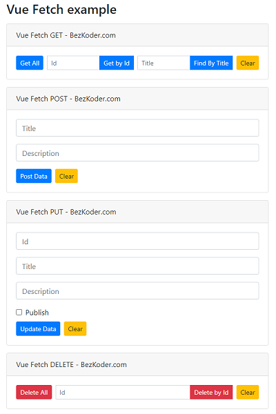

# Vue Fetch example with Rest API

Vue Client with Fetch API to make CRUD requests to Rest API in that:
- Vue Fetch GET request: get all Tutorials, get Tutorial by Id, find Tutorial by title
- Vue Fetch POST request: create new Tutorial
- Vue Fetch PUT request: update an existing Tutorial
- Vue Fetch DELETE request: delete a Tutorial, delete all Tutorials



For instruction, please visit:
> [Vue Fetch example - Get/Post/Put/Delete with Rest API](https://www.bezkoder.com/vue-fetch-example/)

Using Axios:
> [Vue 2 CRUD example with Axios and Vue Router](https://www.bezkoder.com/vue-js-crud-app/)

> [Vue 3 CRUD example with Axios and Vue Router](https://www.bezkoder.com/vue-3-crud/)

More Practice:
> [Vue Pagination with Axios and API example](https://www.bezkoder.com/vue-pagination-axios/)

> [Vue JWT Authentication with Vuex and Vue Router](https://www.bezkoder.com/jwt-vue-vuex-authentication/)

> [Vue File Upload example using Axios](https://www.bezkoder.com/vue-axios-file-upload/)

Fullstack with Node Express:
> [Vue + Node Express + MySQL](https://www.bezkoder.com/vue-js-node-js-express-mysql-crud-example/)

> [Vue + Node Express + PostgreSQL](https://www.bezkoder.com/vue-node-express-postgresql/)

> [Vue + Node Express + MongoDB](https://www.bezkoder.com/vue-node-express-mongodb-mevn-crud/)

Fullstack with Spring Boot:
> [Vue + Spring Boot](https://www.bezkoder.com/spring-boot-vue-js-crud-example/)

> [Vue + Spring Boot + MongoDB](https://www.bezkoder.com/spring-boot-vue-mongodb/)

Fullstack with Django:
> [Vue + Django](https://www.bezkoder.com/django-vue-js-rest-framework/)

Integration (run back-end & front-end on same server/port)
> [Integrate Vue with Spring Boot](https://www.bezkoder.com/integrate-vue-spring-boot/)

> [Integrate Vue App with Node Express](https://www.bezkoder.com/serve-vue-app-express/)

Serverless with Firebase:
> [Vue Firebase Realtime Database: CRUD example](https://www.bezkoder.com/vue-firebase-realtime-database/)

> [Vue Firestore CRUD example](https://www.bezkoder.com/vue-firestore-crud/)

## Project setup
```
npm install
```

### Compiles and hot-reloads for development
```
npm run serve
```

### Compiles and minifies for production
```
npm run build
```

### Lints and fixes files
```
npm run lint
```

### Customize configuration
See [Configuration Reference](https://cli.vuejs.org/config/).
